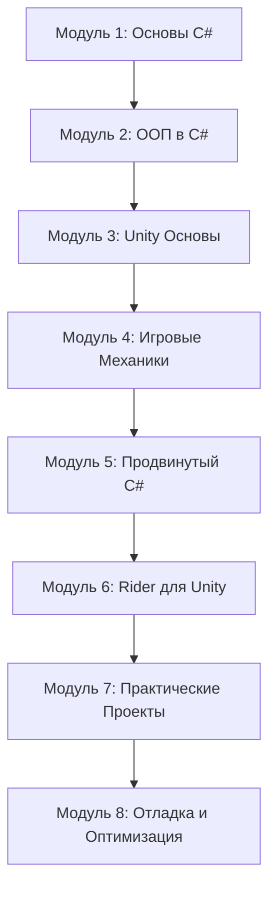
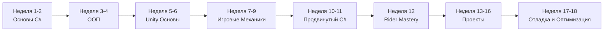

# Design Document: Unity C# Learning Plan

## Overview

Этот документ описывает структуру и организацию комплексного плана обучения C# для разработки игр на Unity. План разработан как прогрессивная система модулей, где каждый последующий модуль строится на знаниях предыдущих. Обучение организовано в виде практических уроков с примерами кода, упражнениями и проектами.

## Architecture

### Learning Path Structure

План обучения организован в 8 основных модулей, каждый из которых содержит:
- Теоретический материал с объяснениями
- Примеры кода с комментариями
- Практические упражнения
- Мини-проекты для закрепления



### Module Organization

Каждый модуль следует единой структуре:

1. **Введение** - обзор темы и целей обучения
2. **Теория** - концепции и принципы
3. **Примеры** - рабочий код с пояснениями
4. **Практика** - упражнения для самостоятельного выполнения
5. **Проект** - практическое применение изученного
6. **Ресурсы** - дополнительные материалы

## Components and Interfaces

### Module 1: Основы C#

**Цель**: Освоить базовый синтаксис C# и фундаментальные концепции программирования

**Темы**:
- Переменные и типы данных (int, float, string, bool)
- Операторы (арифметические, логические, сравнения)
- Условные конструкции (if/else, switch)
- Циклы (for, while, foreach)
- Массивы и коллекции (List, Dictionary)
- Методы и параметры
- Область видимости переменных

**Практические примеры**:
- Система подсчета очков
- Простой калькулятор урона
- Генератор случайных событий
- Система инвентаря (базовая)

### Module 2: ООП в C#

**Цель**: Понять принципы объектно-ориентированного программирования и их применение в играх

**Темы**:
- Классы и объекты
- Конструкторы и деструкторы
- Свойства (Properties) и поля
- Наследование и полиморфизм
- Инкапсуляция и модификаторы доступа
- Абстрактные классы и интерфейсы
- Статические члены класса
- Паттерны проектирования (Singleton, Factory, Observer)

**Практические примеры**:
- Иерархия классов врагов (Enemy -> Zombie, Soldier, Boss)
- Система оружия с наследованием
- Интерфейс для интерактивных объектов
- Менеджер игры (Singleton)
- Система событий (Observer pattern)

### Module 3: Unity Основы

**Цель**: Изучить специфичные для Unity концепции и API

**Темы**:
- MonoBehaviour lifecycle (Awake, Start, Update, FixedUpdate, LateUpdate)
- GameObject и Component система
- Transform и манипуляция объектами
- Prefabs и Instantiate
- Coroutines и асинхронные операции
- ScriptableObjects для данных
- Unity Events и UnityAction
- Работа с Input System (старый и новый)
- Сериализация ([SerializeField], [HideInInspector])

**Практические примеры**:
- Скрипт движения игрока
- Система спавна врагов
- Таймеры и задержки через Coroutines
- Конфигурация оружия через ScriptableObjects
- Система событий UI

### Module 4: Игровые Механики

**Цель**: Реализовать основные игровые системы и механики

**Темы**:

**4.1 Движение и управление**:
- Character Controller vs Rigidbody
- Движение в 2D и 3D
- Прыжки и гравитация
- Dash и специальные движения

**4.2 Камера**:
- Follow camera
- Cinemachine основы
- Camera shake эффекты
- Переключение между камерами

**4.3 Физика и коллизии**:
- Colliders и Triggers
- Raycast и Physics queries
- Layers и collision matrix
- OnCollisionEnter/OnTriggerEnter

**4.4 Боевая система**:
- Система здоровья
- Нанесение и получение урона
- Система оружия и стрельбы
- Система перезарядки

**4.5 UI и HUD**:
- Canvas и UI элементы
- Health bars и индикаторы
- Меню и паузы
- Система диалогов

**4.6 Анимация**:
- Animator Controller
- Animation States и Transitions
- Blend Trees
- Animation Events

**Практические примеры**:
- Полноценный контроллер персонажа (3D)
- Платформер контроллер (2D)
- Система стрельбы с различными типами оружия
- Боевая система ближнего боя
- Интерактивный HUD с анимациями

### Module 5: Продвинутый C#

**Цель**: Освоить продвинутые концепции C# для создания сложных систем

**Темы**:
- Delegates и Events
- Action и Func
- Lambda выражения
- LINQ запросы
- Generics (обобщения)
- Extension methods
- Null-conditional operators (?. и ??)
- Async/Await (для загрузки ресурсов)
- Attributes и Reflection (базовые)

**Практические примеры**:
- Event-driven архитектура игры
- Система достижений через события
- Система квестов с LINQ
- Generic Object Pool
- Асинхронная загрузка уровней
- Custom Inspector attributes

### Module 6: Rider для Unity

**Цель**: Максимально эффективно использовать Rider для Unity разработки

**Темы**:
- Настройка Rider для Unity
- Горячие клавиши и shortcuts
- Отладка Unity проектов
- Breakpoints и watches
- Рефакторинг кода
- Code generation и templates
- Unity-specific inspections
- Performance profiling
- Git интеграция
- Rider plugins для Unity

**Практические примеры**:
- Пошаговая отладка игровой логики
- Рефакторинг legacy кода
- Создание code snippets
- Использование TODO и задач
- Анализ производительности

### Module 7: Практические Проекты

**Цель**: Применить все изученные концепции в реальных проектах

**Проекты** (от простого к сложному):

**7.1 Flappy Bird Clone (2D)**:
- Движение персонажа
- Процедурная генерация препятствий
- Система очков
- Game Over и рестарт
- Простой UI

**7.2 Top-Down Shooter (2D)**:
- Движение в 8 направлениях
- Стрельба с поворотом к курсору
- Враги с AI
- Система волн
- Power-ups и улучшения

**7.3 Platformer (2D)**:
- Продвинутое движение (прыжки, wall jump)
- Система чекпоинтов
- Враги и ловушки
- Собираемые предметы
- Несколько уровней

**7.4 First-Person Shooter (3D)**:
- FPS контроллер
- Система оружия с перезарядкой
- Враги с NavMesh AI
- Система здоровья и брони
- Уровень с целями

**7.5 RPG Combat System (3D)**:
- Система характеристик
- Инвентарь и экипировка
- Боевая система с навыками
- Система квестов
- Сохранение прогресса

### Module 8: Отладка и Оптимизация

**Цель**: Научиться находить и исправлять ошибки, оптимизировать производительность

**Темы**:
- Debug.Log и продвинутое логирование
- Unity Profiler
- Memory Profiler
- Frame Debugger
- Общие ошибки и их решения
- Оптимизация кода
- Object Pooling
- Оптимизация физики
- Оптимизация рендеринга
- Best practices для производительности

**Практические примеры**:
- Поиск memory leaks
- Оптимизация системы спавна
- Профилирование игровой сцены
- Реализация Object Pool
- Оптимизация UI

## Data Models

### Learning Module Structure

```csharp
public class LearningModule
{
    public string ModuleName { get; set; }
    public int ModuleNumber { get; set; }
    public string Description { get; set; }
    public List<Topic> Topics { get; set; }
    public List<CodeExample> Examples { get; set; }
    public List<Exercise> Exercises { get; set; }
    public Project CapstoneProject { get; set; }
    public List<string> Resources { get; set; }
}

public class Topic
{
    public string Title { get; set; }
    public string Theory { get; set; }
    public DifficultyLevel Difficulty { get; set; }
    public List<string> KeyConcepts { get; set; }
}

public class CodeExample
{
    public string Title { get; set; }
    public string Description { get; set; }
    public string Code { get; set; }
    public string Explanation { get; set; }
    public bool IsUnitySpecific { get; set; }
}

public class Exercise
{
    public string Title { get; set; }
    public string Instructions { get; set; }
    public string Hints { get; set; }
    public string SolutionCode { get; set; }
    public DifficultyLevel Difficulty { get; set; }
}

public class Project
{
    public string Name { get; set; }
    public string Description { get; set; }
    public List<string> Requirements { get; set; }
    public List<string> Steps { get; set; }
    public List<string> ExtensionIdeas { get; set; }
}

public enum DifficultyLevel
{
    Beginner,
    Intermediate,
    Advanced
}
```

## Error Handling

### Common Learning Obstacles

1. **Синтаксические ошибки**: Каждый пример кода будет включать объяснение распространенных ошибок
2. **Unity-специфичные проблемы**: Отдельный раздел с troubleshooting для Unity API
3. **Концептуальные непонимания**: Альтернативные объяснения сложных тем
4. **Rider setup issues**: Пошаговое руководство по настройке и решению проблем

## Testing Strategy

### Validation Approach

1. **Code Examples**: Все примеры кода должны быть протестированы в Unity
2. **Exercises**: Каждое упражнение должно иметь проверенное решение
3. **Projects**: Все проекты должны быть реализованы и работать корректно
4. **Progressive Difficulty**: Каждый модуль должен логически следовать из предыдущего

### Quality Criteria

- Код должен следовать C# naming conventions
- Примеры должны демонстрировать best practices
- Комментарии должны быть на русском языке для лучшего понимания
- Каждая концепция должна иметь практическое применение в играх

## Implementation Notes

### File Organization

```
MyLearn/
├── Module01_CSharpBasics/
│   ├── 01_Variables.cs
│   ├── 02_Operators.cs
│   ├── 03_Conditionals.cs
│   ├── 04_Loops.cs
│   ├── 05_Arrays.cs
│   ├── 06_Methods.cs
│   └── Exercises/
├── Module02_OOP/
│   ├── 01_Classes.cs
│   ├── 02_Inheritance.cs
│   ├── 03_Interfaces.cs
│   ├── 04_Patterns.cs
│   └── Exercises/
├── Module03_UnityBasics/
│   ├── 01_MonoBehaviour.cs
│   ├── 02_GameObjects.cs
│   ├── 03_Coroutines.cs
│   ├── 04_ScriptableObjects.cs
│   └── Exercises/
├── Module04_GameMechanics/
│   ├── Movement/
│   ├── Camera/
│   ├── Combat/
│   ├── UI/
│   └── Animation/
├── Module05_AdvancedCSharp/
│   ├── 01_Delegates.cs
│   ├── 02_Events.cs
│   ├── 03_LINQ.cs
│   ├── 04_Generics.cs
│   └── Exercises/
├── Module06_RiderTips/
│   └── RiderGuide.md
├── Module07_Projects/
│   ├── Project01_FlappyBird/
│   ├── Project02_TopDownShooter/
│   ├── Project03_Platformer/
│   ├── Project04_FPS/
│   └── Project05_RPG/
└── Module08_Debugging/
    ├── DebuggingGuide.md
    ├── OptimizationExamples.cs
    └── CommonErrors.md
```

### Rider-Specific Features to Highlight

- **Unity Explorer**: Навигация по Unity объектам
- **Unity Event Functions**: Автодополнение Unity методов
- **Shader Support**: Подсветка синтаксиса шейдеров
- **Performance Indicators**: Предупреждения о производительности
- **Unity Code Analysis**: Специфичные для Unity инспекции
- **External Tools**: Интеграция с Unity Profiler

## Best Practices Integration

Каждый модуль будет включать секцию "Best Practices", охватывающую:
- Naming conventions (PascalCase, camelCase)
- Code organization
- Performance considerations
- Memory management
- Unity-specific optimizations
- Common pitfalls to avoid

## Progressive Learning Path



Рекомендуемый темп: 10-15 часов в неделю для полного освоения материала за 4-5 месяцев.
